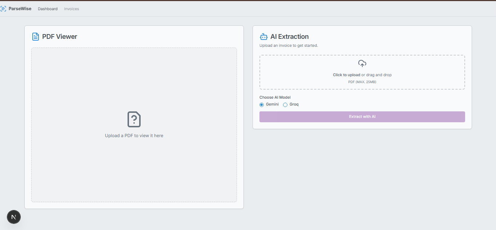
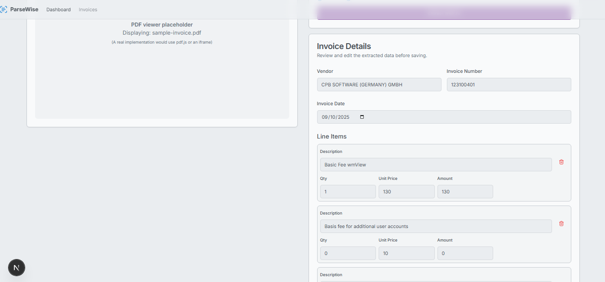

# 📄 PDF Viewer + AI Extraction Dashboard

A web dashboard to **upload PDFs, extract invoice data using AI (Gemini), edit/save it, and manage invoices in MongoDB**.

---
## 🖼️ Screenshots
**PDF Viewer**  


**Editable Invoice Form**  

## 🎯 Project Overview

This project allows users to:

- **Upload PDFs** (≤25 MB) and view them in-browser with **zoom & page navigation**.
- **Extract invoice data** using **Gemini AI**:
  - Vendor: name, address, taxId
  - Invoice: number, date, currency, subtotal, taxPercent, total, poNumber, poDate
  - Line items: description, unitPrice, quantity, total
- **Edit and save data** in MongoDB with **full CRUD functionality**.
- **View all invoices** in a table with **search** by vendor name or invoice number.

---

## 🖼️ App Layout

+--------------------+---------------------------+
| PDF Viewer | Editable Invoice Form |
| (Left Panel) | (Right Panel) |
| Zoom & Navigation | Vendor, Invoice, LineItems|
+--------------------+---------------------------+

yaml
Copy code

---

## 🛠️ Setup (One Command Per App)

### 1️⃣ Clone the Repository
```bash
git clone https://github.com/<your-username>/<project-name>.git
cd <project-name>
2️⃣ Install Dependencies
bash
Copy code
# Frontend
cd apps/web
npm install

# Backend
cd ../api
npm install
3️⃣ Environment Variables
Create a .env file in apps/api:

env
Copy code
MONGODB_URI=<your-mongodb-uri>
GEMINI_API_KEY=<your-existing-gemini-api-key>
# OR GROQ_API_KEY=<your-groq-api-key>
🚀 Run Locally
bash
Copy code
# Frontend
cd apps/web
npm run dev
# Open in browser: http://localhost:3000

# Backend
cd apps/api
npm run dev
# API runs at http://localhost:4000
🌐 Deployed URLs
(Add once deployed)

Frontend: https://<project>-web.vercel.app

Backend API: https://<project>-api.vercel.app

📋 API Endpoints
Method	Route	Description	Request / Response
POST	/upload	Upload a PDF	form-data file → { fileId, fileName }
POST	/extract	Extract invoice data	{ fileId, model: "gemini" } → JSON
GET	/invoices	List all invoices (+ search)	→ Array of invoice objects
GET	/invoices/:id	Fetch one invoice	→ Single invoice object
PUT	/invoices/:id	Update invoice	JSON body → Updated invoice object
DELETE	/invoices/:id	Delete invoice	→ { message: "Invoice deleted successfully" }

⚡ Notes & Best Practices
Keep API keys & MongoDB URI secure using .env files.

AI extraction is server-side only to protect your key.

Always follow the JSON structure for saving/updating invoices.

Do not commit sensitive information to GitHub.

📂 Minimal Data Structure (MongoDB)
json
Copy code
{
  "fileId": "string",
  "fileName": "string",
  "vendor": { "name": "string", "address": "string", "taxId": "string" },
  "invoice": {
    "number": "string",
    "date": "string",
    "currency": "string",
    "subtotal": 0,
    "taxPercent": 0,
    "total": 0,
    "poNumber": "string",
    "poDate": "string",
    "lineItems": [
      { "description": "string", "unitPrice": 0, "quantity": 0, "total": 0 }
    ]
  },
  "createdAt": "string",
  "updatedAt": "string"
}
